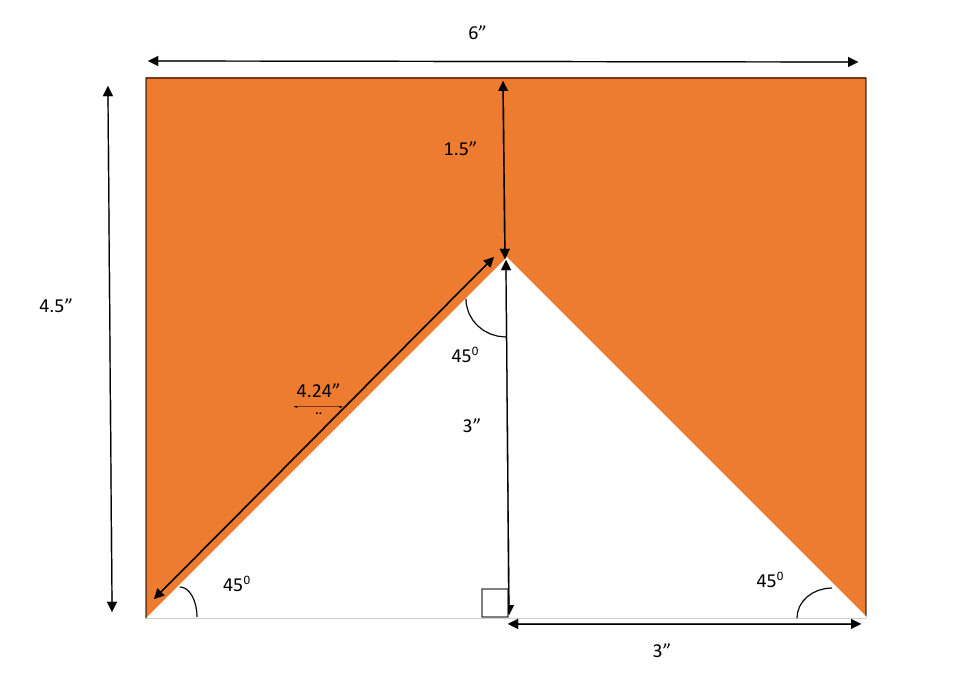
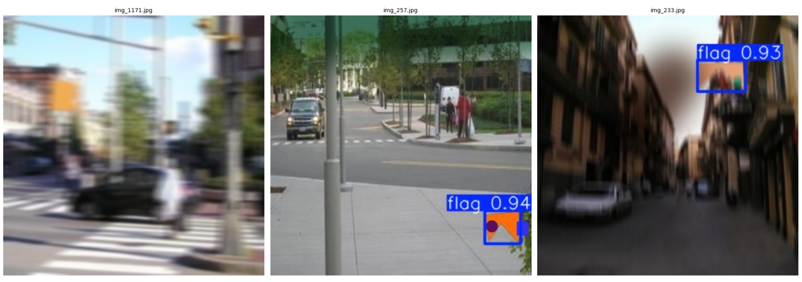

# Synthetic Data Generation for Flag Object Detection

A computer vision project that investigates whether progressively augmented synthetic datasets can improve the generalization of object detection models when no real-world training images are available.

## Overview

Collecting and annotating real-world object detection datasets is expensive, time-consuming, and often impractical as there can be privacy constraints(example, patient data should be kept secure and private) or the technology is still under development and there's no real world data. This project proposes a synthetic data generation pipeline that creates progressively more realistic datasets from a single flag image composited onto natural scene backgrounds.

Three object detection models—YOLOv8n, YOLOv8s, and Faster R-CNN—are trained on four synthetic datasets of increasing complexity and evaluated on an unseen synthetic dataset to analyze generalization under zero-shot conditions.

---

## Problem Statement

Examine whether object detection models are capable of detecting a custom flag in unseen environments using only synthetically generated training images, without access to any real-world training data.

---

## Objectives

- Generate synthetic object detection datasets from a single flag template.
- Give below is the flag we are using with measurements in inches
  
- Study the effect of progressive domain randomization on model generalization.
- Compare lightweight and two-stage object detectors.
- Evaluate robustness on an unseen synthetic test dataset.

---

## Dataset Pipeline
Dataset Overview
| Dataset | Total Images | Train | Validation | Test | Role |
|---------|-------------:|------:|-----------:|-----:|------|
| Dataset A | 1,000 | 700 | 200 | 100 | Train + Test |
| Dataset B | 1,000 | 700 | 200 | 100 | Train + Test |
| Dataset C | 1,000 | 700 | 200 | 100 | Train + Test |
| Dataset D | 1,000 | 700 | 200 | 100 | Train + Test |
| Dataset E | 500 | – | – | 500 | **Unseen Test Only** |
|Stanford Background Dataset | 715|-|-|-|Train Only|

### Dataset A
- Stanford Background Dataset
- Random background selection
- Random object scaling
- Random object placement

### Dataset B
Dataset A +
- Perspective warp
- Brightness adjustment
- Contrast adjustment
- Saturation adjustment

### Dataset C
Dataset B +
- Gaussian noise
- Gaussian blur
- Shadow augmentation

### Dataset D
Dataset C +
- Random occlusions

### Dataset E (Unseen Test Set)

Contains synthetic images of flags having similar (not exact) shape as our original flag  generated and not observed during training and is used exclusively for evaluating model generalization.

---

## Methodology

1. Remove background from the flag image.
2. Randomly select a natural scene background.
3. Resize and position the flag.
4. Apply progressive augmentations.
5. Automatically generate tight bounding box annotations.
6. Train object detection models.
7. Evaluate on unseen synthetic data.
8. Compare performance across datasets.

---

## Models Evaluated

- YOLOv8n
- YOLOv8s
- Faster R-CNN

---

## Evaluation Metrics

- Precision
- Recall
- mAP@0.50
- mAP@0.50:0.95
- Training Time
- Inference Time

---

## Tech Stack

### Programming Language
- Python

### Libraries
- OpenCV
- NumPy
- Ultralytics
- PyTorch
- Torchvision
- Matplotlib
- Pandas

---

## Project Structure

```text
Flag_Identification/
│
├── datasets/
│   ├── Dataset_A/
│   │   ├── images/
│   │   └── labels/
│   │
│   ├── Dataset_B/
│   │   ├── images/
│   │   └── labels/
│   │
│   ├── Dataset_C/
│   │   ├── images/
│   │   └── labels/
│   │
│   ├── Dataset_D/
│   │   ├── images/
│   │   └── labels/
│   │
│   └── Dataset_E/
│       ├── images/
│       └── labels/
│
├── scripts/
│   ├── generate_dataset_A.py
│   ├── generate_dataset_B.py
│   ├── generate_dataset_C.py
│   ├── generate_dataset_D.py
│   ├── train_yolov8.py
│   ├── train_faster_rcnn.py
│   ├── evaluate.py
│   └── inference.py
│
│
├── results/
│   ├── figures/
│   │   ├── datasetA_sample.png
│   │   ├── datasetB_sample.png
│   │   ├── datasetC_sample.png
│   │   ├── datasetD_sample.png
│   │   └── datasetE_sample.png
│   │
│   │
│   └── tables/
│       ├── yolov8n_results.csv
│       ├── yolov8s_results.csv
│       └── faster_rcnn_results.csv
│
├── report/
│   ├── Project_Report.pdf
│   
│
└── assets/
    ├── flag.png
    ├── flag_design_background_removed.png
    
```

## Results
Training Results of YOLOv8n on Synthetic Datasets
| Dataset | Precision | Recall | mAP@0.50 | mAP@0.50:0.95 | Training Time (min) | Inference Time (ms) |
|----------|----------:|-------:|---------:|--------------:|--------------------:|--------------------:|
| Dataset A | 0.9995 | 1.0000 | 0.9950 | 0.9770 | 12.34 | 12.19 |
| Dataset B | 0.9994 | 1.0000 | 0.9950 | 0.9125 | 11.52 | 9.93 |
| Dataset C | 0.9994 | 1.0000 | 0.9950 | 0.9312 | 12.18 | 10.46 |
| Dataset D | 1.0000 | 0.9893 | 0.9936 | 0.8526 | 11.41 | 10.01 |

Training Results of YOLOv8s on Synthetic Datasets
| Dataset | Precision | Recall | mAP@0.50 | mAP@0.50:0.95 | Training Time (min) | Inference Time (ms) |
|----------|----------:|-------:|---------:|--------------:|--------------------:|--------------------:|
| Dataset A | 0.9995 | 1.0000 | 0.9950 | 0.9790 | 13.81 | 13.78 |
| Dataset B | 0.9997 | 1.0000 | 0.9950 | 0.9372 | 19.32 | 15.59 |
| Dataset C | 0.9994 | 1.0000 | 0.9950 | 0.9328 | 13.49 | 13.93 |
| Dataset D | 0.9955 | 0.9800 | 0.9847 | 0.8330 | 13.83 | 14.29 |

Test Results of YOLOv8n on unseen DATASET E(unseen)
| Dataset   | Precision (%) | Recall (%) | mAP@0.50 | mAP@0.50:0.95 |
|------------|--------------:|-----------:|---------:|--------------:|
| Dataset A | 46.49 | 46.40 | 0.3875 | 0.2104 |
| Dataset B | 61.72 | 59.00 | 0.5286 | 0.3516 |
| Dataset C | 90.49 | 49.46 | 0.5813 | 0.4018 |
| Dataset D | 95.76 | 81.35 | 0.9104 | 0.5589 |

Test Results of YOLOv8s on unseen DATASET E(unseen)
| Dataset   | Precision (%) | Recall (%) | mAP@0.50 | mAP@0.50:0.95 |
|------------|--------------:|-----------:|---------:|--------------:|
| Dataset A | 47.18 | 48.60 | 0.3848 | 0.2131 |
| Dataset B | 66.80 | 64.80 | 0.6060 | 0.4073 |
| Dataset C | 64.10 | 58.20 | 0.5305 | 0.3614 |
| Dataset D | 93.45 | 76.20 | 0.8801 | 0.5622 |

Finally, YOLOv8n has been selected as our detector and given figure below shows model's prediction on Dataset E (random 3 samples)

-img_1171 has a sqaure flag similar to our original flag and is of orange color. The detector ignores it as it isn't our target (Prediction : False).

-img_257 and img_233 contain our original flags and detector detects it with given confidence score.

Key observations from the experiments include:

- Near-perfect performance on synthetic training datasets.
- Progressive augmentation improved robustness to unseen data.
- Dataset D produced the highest generalization performance.
- YOLOv8s achieved the best detection accuracy.
- YOLOv8n provided faster inference with competitive performance.
- Faster R-CNN achieved required significantly longer training time(1 hour).

---

## Future Work

- Evaluate on real-world flag images.
- Integrate diffusion-based synthetic image generation.
- Explore transformer-based object detectors.
- Extend the framework to multi-class object detection.

---

## References (Stanford Background Dataset)

-S. Gould, R. Fulton, D. Koller. Decomposing a Scene into Geometric and Semantically Consistent Regions. Proceedings International Conference on Computer Vision (ICCV), 2009

---

